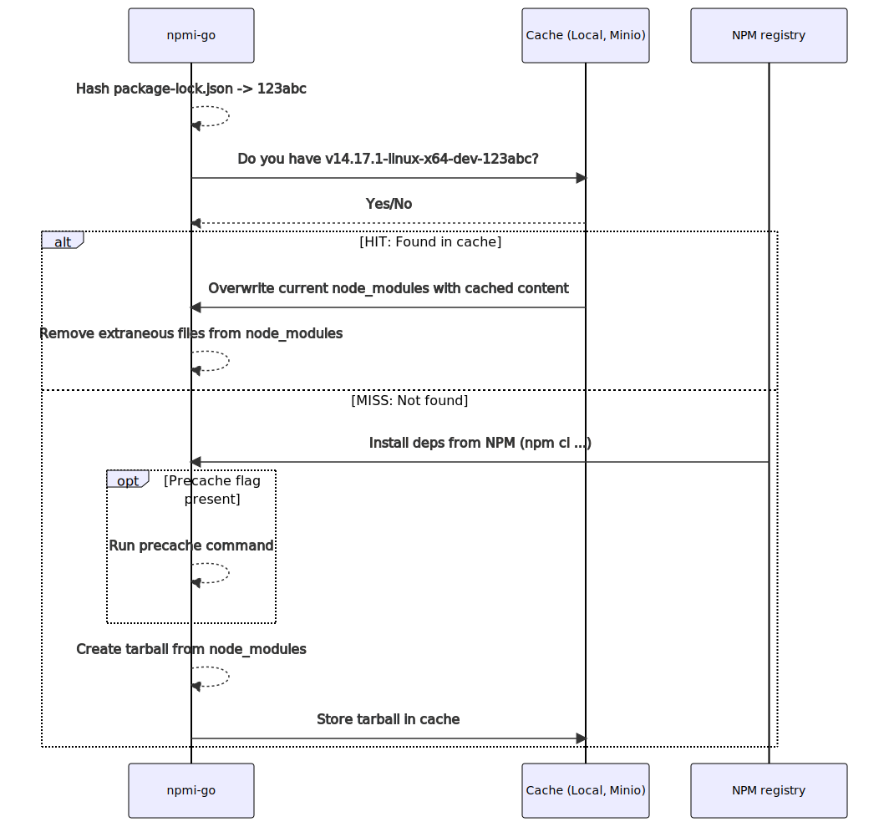

[](https://github.com/hermo/npmi-go/actions/workflows/codeql-analysis.yml)

# npmi-go
npmi-go caches the contents of node_modules directory in a tarball stored
locally or in a Minio instance. The Node runtime environment and a hash of
package-lock.json is used as the cache key.

The cache key is something like
`v12.16.3-darwin-x64-dev-78c49bbaba2e4002e313e55018716d9a673fa99f1e676afcb03df0a902f4883f`.



# Not for production (yet)
Note that npmi-go is work-in-progress and should not be used in production.

# Installation
- Download a prebuilt binary from the [releases page](https://github.com/hermo/npmi-go/releases/latest)

# Building

## Quick & dirty
Just run `go build` in the root directory to build `npmi-go` binary.

## Goreleaser
Dev builds for your system only may be built by using goreleaser:

```
goreleaser build --snapshot --rm-dist --single-target
```

The output will appear under `dist/`.

Creating a symlink with a shorter name is recommended for testing:
`ln -s dist/npmi-go_linux_amd64/npmi-go`

# Releasing

1. Create a git tag with the desired version
```
git tag v0.4.0
```
2. Create a release build to see if everything is setup correctly
```
goreleaser release --rm-dist --skip-publish
```
3. If everything seems OK, release to Github by running
```
goreleaser release --rm-dist
```

# Supported Caches

## Local

The local cache is a directory containing tarballs.

It is enabled by default and caches to the system temp directory.

To disable the local cache use the flag `-local=0`.

See the `-local*` options in usage for more info.

## Minio

A [Minio](https://min.io/) instance may also be used as a cache backend.

Using Minio allows several clients to share the same cache. CI systems often
install the same deps over and over again and using a shared cache will
reduce bandwidth, IO and CPU usage significantly.

### Security notice
Note that the contents of a tarball in the cache are not checked in any way
and only trusted systems should be allowed to access the shared cache.

### Testing with Minio

1. Start a temporary Minio instance using Docker:
```
docker run --rm --name minio \
-p 9000:9000 -p 9001:9001 \
-e "MINIO_ROOT_USER=minio" \
-e "MINIO_ROOT_PASSWORD=password" \
-v "$PWD/test/minio/certs:/root/.minio/certs" \
minio/minio \
server /data --console-address ":9001"
```
2. Edit `test/minio/config.json` and change the IP to match whatever Minio reports.
3. Create a bucket called `npmi` using Minio Client:
```
docker run -v "$PWD/test/minio/config.json:/root/.mc/config.json" minio/mc --insecure mb minio/npmi
```
4. Use the dummy project under `testdata/` and run npmi-go using minio:
```
cd testdata
../npmi-go -loglevel debug \
-minio=1 \
-minio-endpoint=localhost:9000 \
-minio-bucket=npmi \
-minio-access-key-id=minio \
-minio-secret-access-key=password \
-minio-tls-insecure \
-local=0
```

Note that we disable the local cache for testing purposes.

```
npmi-go start
Lookup start, looking for cache key v14.17.1-linux-x64-dev-774058b9ec06e745270e3dff174406ba12b86bc2bc1b9daf9eb42485b4e20c13
Lookup(minio).Has start
Lookup(minio).Has complete: MISS
Lookup complete
Install start
Install(npm).InstallPackages start
Install(npm).InstallPackages complete: success: added 1 packages in 0.071s
Install complete
Archive start
Archive creating modules-v14.17.1-linux-x64-dev-774058b9ec06e745270e3dff174406ba12b86bc2bc1b9daf9eb42485b4e20c13.tar.gz
Archive complete
Cache start
Cache.OpenArchive start
Cache.OpenArchive complete
Cache(minio).Put start
Cache(minio).Put complete
Cache complete
Post-Archive: Removed temporary archive modules-v14.17.1-linux-x64-dev-774058b9ec06e745270e3dff174406ba12b86bc2bc1b9daf9eb42485b4e20c13.tar.gz
npmi-go complete
```

Now run the same `npmi-go` command again. The output will be something like:

```
npmi-go start
Lookup start, looking for cache key v14.17.1-linux-x64-dev-774058b9ec06e745270e3dff174406ba12b86bc2bc1b9daf9eb42485b4e20c13
Lookup(minio).Has start
Lookup(minio).Has complete: HIT
Lookup(minio).Get start
Lookup(minio).Get complete
Lookup(minio).Extract start
Cleanup start
Cleanup complete, 0 extraneous files removed
Lookup(minio).Extract complete
Lookup complete
npmi-go complete
```

See the `-minio*` options in usage for more info.
# Usage

```
npmi-go dev, commit none, built at unknown.
npmi-go installs NPM packages from a cache to speed up repeating installations.

Supported caches:
-  local          Data is cached locally in a directory.
-  minioData is cached to a (shared) Minio instance.

When using both caches, the local one is accessed first.

USAGE:
 npmi-go [OPTIONS]

ENVIRONMENT VARIABLES:
Use the following env variables to set default options.

  NPMI_LOGLEVEL  Log level. One of info|debug|trace (Default: "info")
  NPMI_JSON      Use JSON for log output (Default: false)
  NPMI_VERBOSE   Verbose output. DEPRECATED
                 Please use NPMI_LOGLEVEL with 'debug' or 'trace'
  NPMI_FORCE     Force (re)installation of deps
  NPMI_PRECACHE  Pre-cache command

Local cache:
  NPMI_LOCAL      Use local cache
  NPMI_LOCAL_DIR  Local cache directory

Minio cache:
  NPMI_MINIO                    Use Minio cache
  NPMI_MINIO_ENDPOINT           Minio endpoint URL
  NPMI_MINIO_ACCESS_KEY_ID      Minio access key ID
  NPMI_MINIO_SECRET_ACCESS_KEY  Minio secret access key
  NPMI_MINIO_BUCKET             Minio bucket name
  NPMI_MINIO_TLS                Use TLS when connection to minio
  NPMI_MINIO_TLS_INSECURE       Disable TLS certificate checks
  NPMI_TEMP_DIR                 Use specified temp directory when creating archives (Default: system temp)

OPTIONS:
  -force
        Force (re)installation of NPM deps and update cache(s)
  -local
        Use local cache (default true)
  -local-dir string
        Local cache directory (default "/tmp")
  -loglevel string
        Log level. One of info|debug|trace (default "info")
  -minio
        Use Minio for caching
  -minio-access-key-id string
        Minio access key ID
  -minio-bucket string
        Minio Bucket
  -minio-endpoint string
        Minio endpoint
  -minio-secret-access-key string
        Minio secret access key
  -minio-tls
        Use TLS to access Minio cache (default true)
  -minio-tls-insecure
        Disable TLS certificate checks
  -precache string
        Run the following shell command before caching packages
  -temp-dir string
        Temporary directory for archive creation (default "/tmp")
```

## Configuration with .npmirc

npmi-go does not currently support a config file.

## Configuration with environment variables

The environment variables described before are used as defaults when present.

# Known Issues

## package-lock.json sync is not checked
npmi-go does not check is a package-lock.json file is in sync with package.lock.

## post-installation side effects outside node_modules/ will be ignored
Any post-installation script of NPM will NOT get run when installing
from cache. This includes at least the following:
- install
- postinstall
