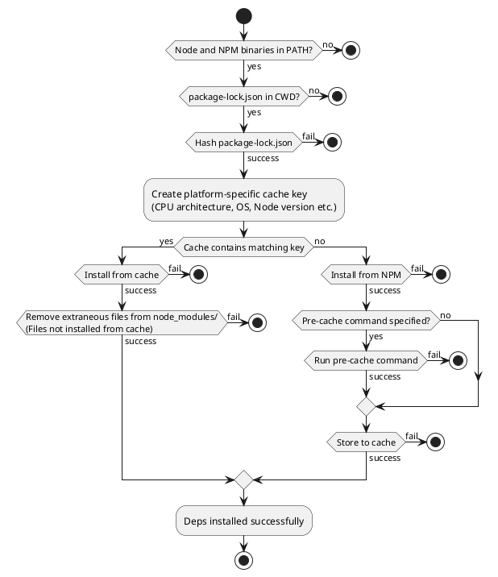

# Dev notes

## Principle of operation

```plantuml
@startuml
start
if (Node and NPM binaries in PATH?) then (no)
  stop
else (yes)
endif

if (package-lock.json in CWD?) then (no)
  stop
else (yes)
endif

if (Hash package-lock.json) then (fail)
  stop
else (success)
endif

:Create platform-specific cache key\n(CPU architecture, OS, Node version etc.);
if (Cache contains matching key) then (yes)
  if (Install from cache) then (fail)
    stop
  else (success)
  endif
  if (Remove extraneous files from node_modules/\n(Files not installed from cache)) then (fail)
    stop  
  else (success)    
  endif
else (no)
  if (Install from NPM) then (fail)
    stop
  else (success)
  endif
  if (Pre-cache command specified?) then (yes)
    if (Run pre-cache command) then (success)
    else (fail)
      stop
    endif
  else (no)
  endif
  if (Store to cache) then (success)
  else (fail)
    stop
  endif
endif
:Deps installed successfully;
stop

@enduml
```